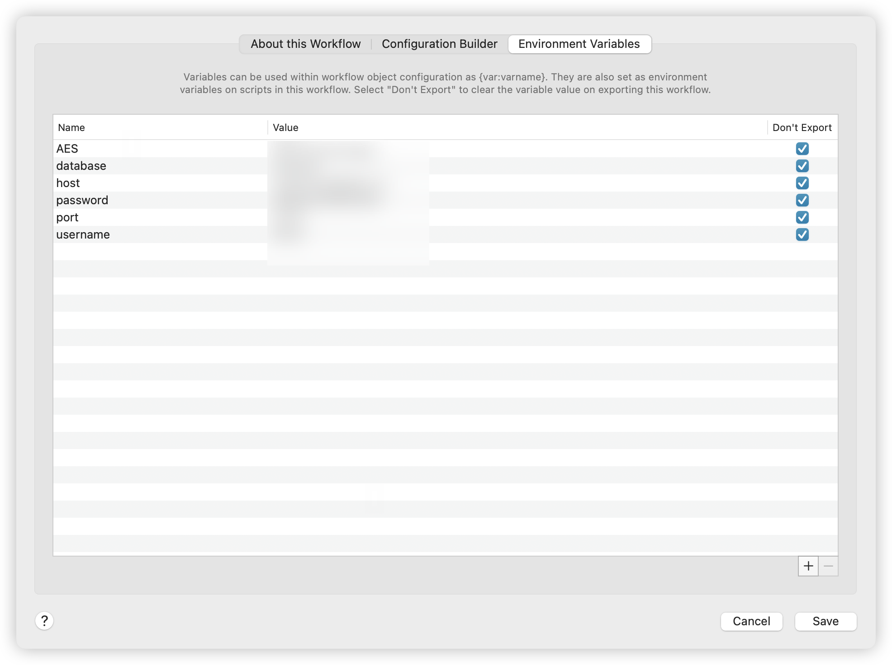

# Alfred-SSH-Util

[中文文档](./README_CN.md) | README in English

---


An alfred workflow for one-click connections to servers

https://user-images.githubusercontent.com/67859663/284560177-6e34177b-a18a-4656-b7e0-d390c32a4f18.mp4


Execute python scripts to read the server configuration information in the mysql database by triggering actions, and connect to the server with one click through the expect shell

## Function

- One-click connection to the server

- Copy the ip address of the server to the clipboard
- Copy the server password to the clipboard

* The database password supports AES encryption and can be decrypted locally by setting AES key alfred environment variable to ensure data security from the client to the MYSQL server

## Environment

* Python3

```shell
pip3 install pymysql
# for connect mysql
pip3 install pycryptodome
# for AES encrypt and decrypt
```

## How to use

Download the latest version of the installation package from realeases, drag it to alfred's workflow, and set the environment variables




The configuration items are as follows:

1. AES encryption key
2. Name of the MYSQL database
3. Address of the database server
4. Password for connecting to the database
5. Database port
6. Username for connecting to the database


The common.sql under this warehouse can be imported into the database you created, and the server information can be filled in according to the fields

Type ssh to get the list of servers by calling up the alfred input box

Select the corresponding server press enter to connect to the server

Select the corresponding server command and press Enter to copy the server ip address to the clipboard

Select the corresponding server option + Press Enter to copy the server password to the clipboard

### Encryption needs

If encryption is not enabled, the encrypt field in the database defaults to 0

If encryption is enabled, encry keyword trigger is also set in this workflow. All passwords in the database are encrypted according to the AES environment variable configuration configured by alfred as the encryption key

**Encryption method**

The ECB mode of AES is used for encryption, because AES requires the number of bytes of plaintext and key to be a multiple of 16, so the data needs to be filled. Because there are various algorithms for filling, it is recommended to directly use workflow to encrypt the data in the database. Alternatively, manually encrypt the store via encryptUtil.py under the repository.

This workflow uses the pkcs7 filling algorithm to fill plaintext or keys that do not meet the 16 multiples

---


**If you encounter any problem, start alfred debug mode to troubleshoot it yourself. If you can't solve it, take a screenshot and issue privacy code**


