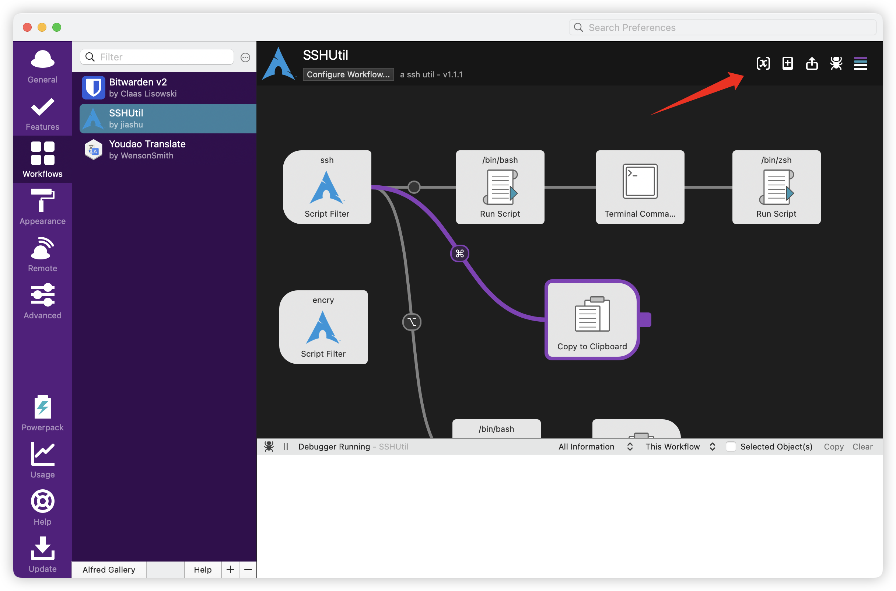
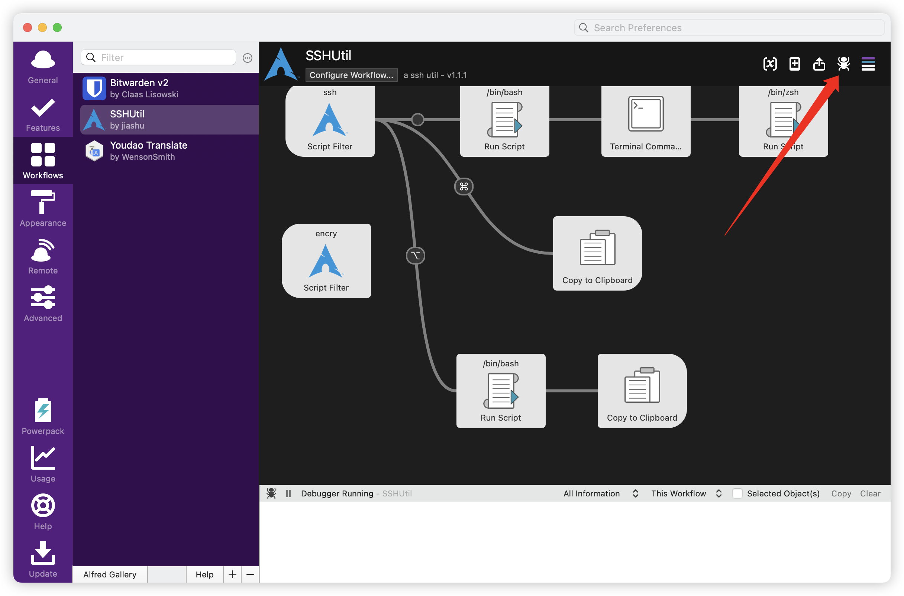

# Alfred-SSH-Util

中文文档 | [README in English](./README.md)

---


一个用于一键连接服务器的alfred workflow


通过触发动作执行 python 脚本读取 mysql 数据库中的服务器配置信息，通过 expect shell 一键连接服务器

## 功能

- 一键连接服务器

- 复制服务器 ip 到剪切板
- 复制服务器密码到剪切板

* 数据库密码支持 AES 加密，本地通过设置 AES 密钥alfred环境变量解密，保证用户端到 MYSQL 服务器数据安全

## 环境要求

* Python3

```shell
pip3 install pymysql
# 用于连接 mysql
pip3 install pycryptodome
# 用于 AES 加解密
```

## 使用教程

从 realeases里下载最新版本安装包拖动到 alfred 的 workflow，设置环境变量




配置项按顺序分别为：

1. AES 加密密钥
2. MYSQL数据库名称
3. 数据库服务器地址
4. 数据库连接密码
5. 数据库端口
6. 数据库连接用户名

---


将本仓库下的 common.sql通过导入你创建的数据库，按字段填写服务器信息即可

通过唤出 alfred 输入框，输入 ssh 获取服务器列表信息

选择对应的服务器回车即可连接服务器

选择对应的服务器command + 回车复制服务器 ip 到剪切板

选择对应的服务器option + 回车，复制服务器密码到剪切板

### 加密需知

如果不启用加密，数据库中 encrypt 字段默认 0 即可

如果启用加密，本 workflow 也设置了 encry 关键词触发一键将数据库所有密码按照alfred 配置的 AES环境变量配置作为加密密钥进行加密

**加密方式**

使用 AES 的ECB模式进行加密，因为 AES 需要让明文和密钥的字节数为 16 的倍数，所以需要对数据进行填充，由于填充有多种算法，建议直接使用 workflow 的方式对数据库中数据加密，或者通过仓库下的encryptUtil.py手动加密存储。

该 workflow 通过 pkcs7 填充算法对不满足 16 倍数的明文或者密钥进行填充

---


**遇到任何问题，先开启 alfred debug 模式自己排查，解决不了，截图，隐私打码发 issue**




